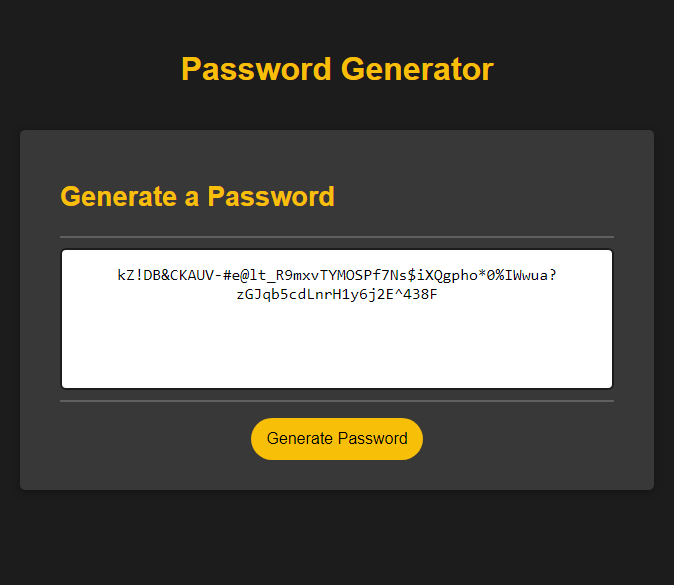

# Secure Randomized Password Generator

## Description

Generate a random secure password based on user input

- Select length of password then if it should include lowercase/uppercase letters, numbers, or special characters

## Usage

- To begin password generation visit the following link: [following link](https://tooboi.github.io/Secure-Password-Generator/)

- After clicking "Generate Password" you will be prompted with several options

- Input the desired length of your password from 8 to 128 characters

- You will then choose if you want the password to include: lowercase letters, uppercase letters, numbers, and special characters

- A password with your specifications will appear in the window

- Simply click the text to highlight all

## License

[MIT License](/LICENSE)
